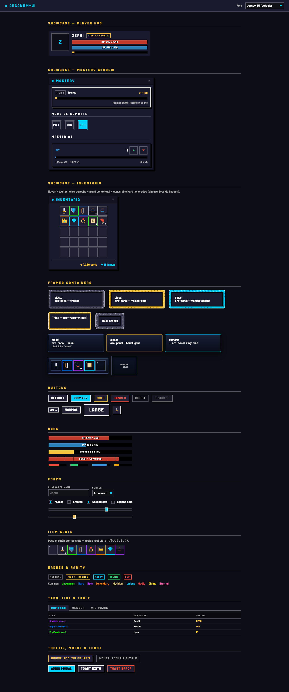

# arcanum-ui

Pixel-art RPG UI library — CSS-first, zero dependencies. Dark navy & cyan theme out of the box, fully re-themeable through CSS custom properties.

Born inside [Arcanum 2D RPG](https://play.arcanum2d.com); inspired by the *usage model* of [RPGUI](https://github.com/RonenNess/RPGUI) (just CSS classes, no required JS) but rebuilt with modern CSS: cascade layers, custom properties, native form controls — no images, no DOM replacement, ~40 KB of fonts instead of 1.35 MB of sprites.



## Install & use

Not on npm yet. Two ways to consume it today:

```bash
# as a git dependency (dist/ is built automatically via the prepare script)
bun add git@github.com:Arcanum2D/arcanum-ui.git

# or vendored as a tarball (what arcanum-client does — deploy-friendly,
# no git/npm access needed inside Docker builds)
bun run build && bun pm pack     # in this repo → arcanum-ui-0.1.0.tgz
# then in your app: "arcanum-ui": "file:./vendor/arcanum-ui-0.1.0.tgz"
```

```ts
import 'arcanum-ui/css';            // everything (tokens + fonts + components)
// or granular:
import 'arcanum-ui/tokens.css';     // just the design tokens
import 'arcanum-ui/fonts.css';      // just the @font-face declarations
```

Everything ships inside the `arc` [cascade layers](https://developer.mozilla.org/en-US/docs/Web/CSS/@layer), so **any unlayered CSS in your app wins by default** — safe to adopt incrementally in an existing project.

```html
<button class="arc-btn arc-btn--primary">Play</button>

<div class="arc-bar arc-bar--hp" style="--arc-bar-value: 72%">
  <div class="arc-bar__fill"></div>
  <span class="arc-bar__text">HP 540 / 750</span>
</div>
```

## Components

| Class | What it is |
|---|---|
| `.arc-btn` | Button. Variants `--primary --gold --danger --ghost`, sizes `--sm --lg`, square `--icon`, toggle group `--toggle` + `.is-active`, steppers `--step-up/--step-down` |
| `.arc-panel` | Framed box. `--light`, `--gold`, `--notched` (pixel-cut corners) |
| `.arc-panel--framed` | RPGUI-style ornate pixel frame with rounded pixel corners (procedural SVG border-image, no image files). Variants `--framed-gold`, `--framed-accent`; thickness via `--arc-frame-w` (multiples of 8px stay crisp). Regenerate with `node scripts/gen-frame.mjs` |
| `.arc-panel--bevel` | Double-bevel "metal" frame: steel ring + black ring + gradient body + top glint. `--bevel-gold` companion; ring/glint per-instance themable via `--arc-bevel-ring/-line/-glint` |
| `.arc-slot--bevel` / `.arc-well--bevel` | Sunken double-bevel counterparts (hotbar slots, inner wells): inverted depth via inner shadow; rarity/selection color the steel ring. Container gap must be ≥ 4px (the ring paints outside the box) |
| `.arc-window` | Panel with `__header`, `__title` (`--gem` diamond), `__close` (leave the button empty — the `×` glyph is injected via CSS so it always uses the pixel font), `__body` |
| `.arc-well` | Sunken inner box (portraits, previews) |
| `.arc-bar` | Progress bar with centered `__text`. `--hp --mp --xp --str --dex --int --vit --thin --ticks`; fill width via `--arc-bar-value` |
| `.arc-input` `.arc-select` `.arc-checkbox` `.arc-radio` `.arc-slider` | Native form controls, restyled (no DOM replacement) |
| `.arc-slot` | Item slot: `data-rarity="1..10"` border, `__item` (draggable wrapper), `__icon` (background-based — works with sprite atlases), `__count`, `__key`, `__cooldown` (via `--arc-cooldown`), grid helper `.arc-slot-grid` |
| `.arc-context-menu` | Right-click menu (`__item`, `--danger`, `__divider`); usually created via `arcContextMenu()` |
| `.arc-badge` | Tag/badge. `--gold --accent --success --danger` |
| `.arc-rarity-1..10` | Rarity text colors |
| `.arc-tooltip` | Tooltip container (`__title __row __flavor`); positioning is app code |
| `.arc-overlay` + `.arc-modal` | Modal dialog + backdrop |
| `.arc-toast` | Notification (usually via `arcToast()`) |
| `.arc-tabs` / `.arc-tab` | Tab strip |
| `.arc-list` `.arc-table` `.arc-divider` `.arc-scroll` `.arc-section-label` | Lists, tables, dividers, pixel scrollbars, section headings |

## Optional JS behaviors

```ts
import { arcToast, arcModal, arcTabs, arcTooltip, setArcFont } from 'arcanum-ui';

arcToast({ message: '+25 mastery', variant: 'success' });

const modal = arcModal(document.querySelector('.arc-overlay')!);
modal.open();

// tabs: each .arc-tab button declares its panel via data-arc-tab="#panel-id"
arcTabs(document.querySelector('.arc-tabs')!);

// tooltip: cursor-follow, viewport-clamped; content may be a lazy factory
// re-evaluated on every show (ideal for live game data)
arcTooltip(slotEl, {
  content: () => `<div class="arc-tooltip__title arc-rarity-4">${item.name}</div>`,
});

// context menu at cursor: closes on select / outside click / Escape
slotEl.addEventListener('contextmenu', (e) => {
  e.preventDefault();
  arcContextMenu(e.clientX, e.clientY, [
    { label: 'Use', onSelect: useItem },
    { label: 'Split', disabled: item.count <= 1, onSelect: splitStack },
    { label: 'Destroy', danger: true, dividerBefore: true, onSelect: destroyItem },
  ]);
});
```

See the demo's *Showcase — Inventario* for a full inventory composed from these pieces (slots + tooltips + context menu + toasts).

## Player font presets

Three bundled pixel fonts (all SIL OFL 1.1). Switch at runtime — component metrics adapt via `--arc-font-scale`:

```ts
setArcFont('jersey');  // Jersey 25 — default
setArcFont('arcade');  // Press Start 2P
setArcFont('clean');   // VT323
```

or simply `<html data-arc-font="arcade">`.

## Theming

Override tokens after importing — no component rule ever hardcodes a color:

```css
:root {
  --arc-accent: #ff6a00;      /* your accent */
  --arc-surface-1: #101820;   /* your panel color */
}
```

Token groups: surfaces, borders, accents, semantic (`success/danger/warning/info`), vitals (`hp/mp/xp`), stats (`str/dex/int/vit`), rarity 1–10, text, z-index scale (`--arc-z-hud … --arc-z-critical`), responsive type/spacing scales, pixel shadows.

## Demo

```bash
bun install && bun run dev   # then open /demo/
```

The kitchen-sink demo doubles as the visual regression fixture — regenerate the screenshots in `docs/` with `bun run demo:screenshot`. It includes a font switcher to validate the three presets against every component.

## License

MIT. Bundled fonts under SIL OFL 1.1.
